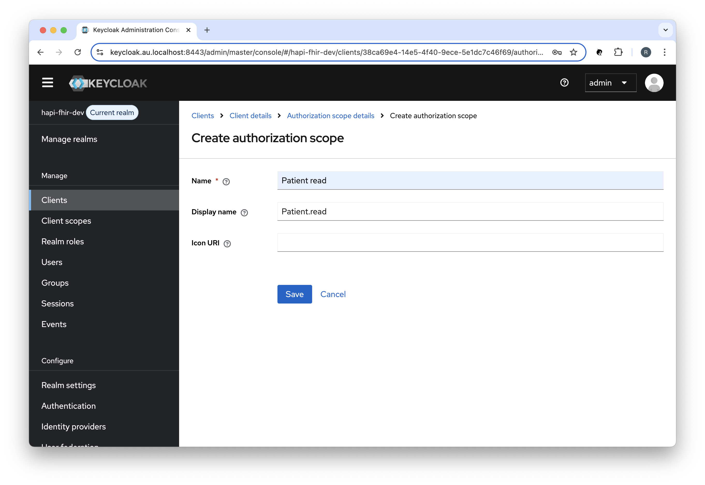
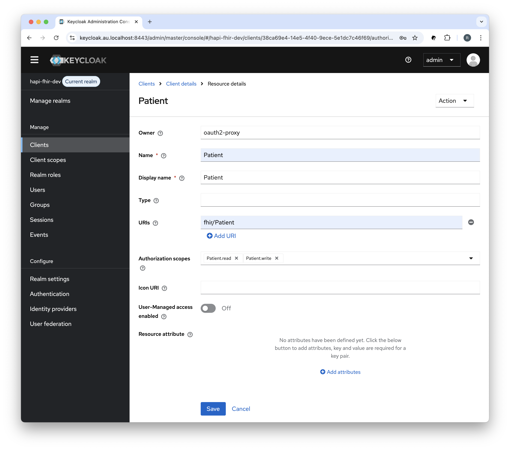
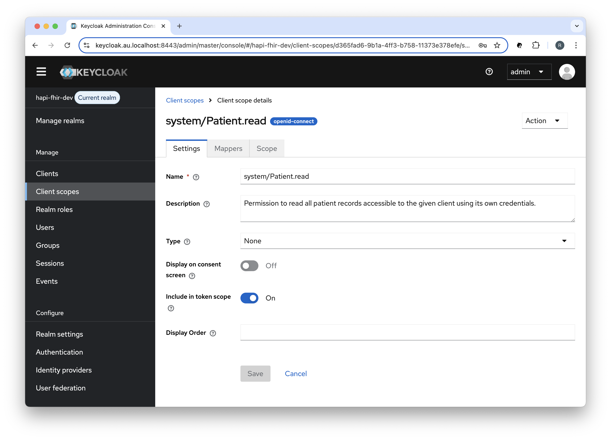
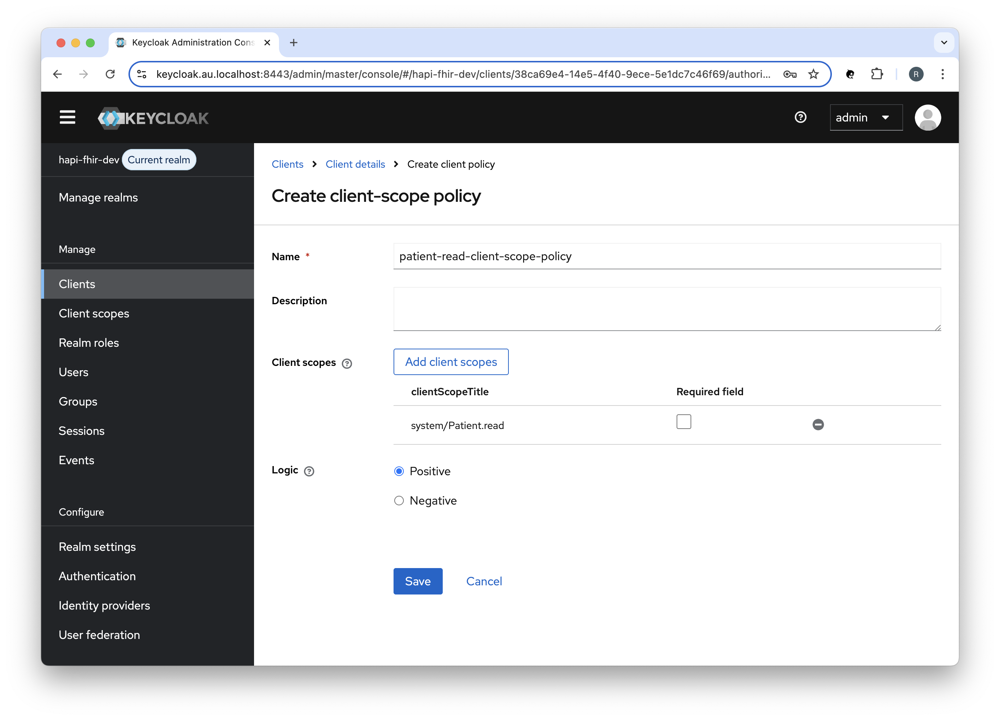
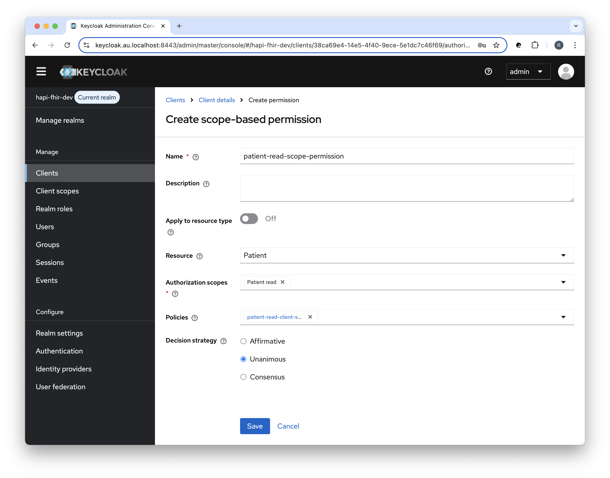

<h1 align="center">Working with APISIX</h1>

## ❯ APISIX

### AuthZ Keycloak plugin

The `authz-keycloak` plugin enables APISIX to leverage the fine-grained authorisation policies and access control mechanisms supported by Keycloak.

See: [Keycloak - Authorization Services Guide](https://www.keycloak.org/docs/latest/authorization_services/)

#### Static permissions

The `authz-keycloak` plugin can be configured to support different authorisation scenarios.

For example, you can configure Keycloak to use scope-based permissions associated with a client scope policy and configure the `authz-keycloak` plugin to use static permissions:

- Resource: **Patient**
- Authorisation Scope: **Patient.read**
- Client Scope: **system/Patient.read**
- Client Scope Policy: patient-read-client-scope-policy
- Scope-based Permission: patient-read-scope-permission

```
  permissions: [ "Patient#Patient.read" ]
```

#### Create an Authorisation Scope in Keycloak

Create an Authorisation Scope (Patient.read) in Keycloak:

<p align="center">
  
</p>

#### Create a Resource in Keycloak

Create a Resource (Patient) in Keycloak:

<p align="center">
  
</p>

#### Create a Client Scope in Keycloak

Create a Client Scope (system/Patient.read) in Keycloak:

<p align="center">
  
</p>

#### Create a Client Scope Policy in Keycloak

Create a Client Scope Policy (patient-read-client-scope-policy) in Keycloak:

<p align="center">
  
</p>

#### Create a Scope-based Permission in Keycloak

Create a Scope-based Permission (patient-read-scope-permission) in Keycloak:

<p align="center">
  
</p>

#### Configure APISIX

Create a route as follows:

```

  ...

  - name: hapi-fhir-api
    host: hapi-fhir.au.localhost
    uri: /fhir/Patient*
    methods: [ "GET" ]
    upstream_id: 1
    plugins:
      authz-keycloak:
        lazy_load_paths: false
        ssl_verify: false
        client_id: ${{CLIENT_ID}}
        client_secret: ${{CLIENT_SECRET}}
        discovery: ${{PROTOCOL}}://${{KEYCLOAK_HOSTNAME}}:${{KEYCLOAK_PORT}}/realms/${{KEYCLOAK_REALM}}/.well-known/openid-configuration
        permissions: [ "Patient#Patient.read" ]
```

See: [apisix-standalone.yml](https://github.com/Robinyo/hapi-fhir-au/blob/main/backend/services/apisix/conf/apisix-standalone.yml)

Each entry in the 'permissions' attribute must be formatted as expected by the token endpoint's permission parameter.

For example: "Resource#Authorisation Scope".

See: [Keycloak - Authorization Services Guide: Obtaining permissions](https://www.keycloak.org/docs/latest/authorization_services/index.html#_service_obtaining_permissions)

### Call the HAPI FHIR API

#### Request a token

To access the API, you must request an access token. You will need to POST to the token URL.

For example (`scope=system/Patient.read`):

```
ACCESS_TOKEN=$(curl -s -X POST https://keycloak.au.localhost:8443/realms/hapi-fhir-dev/protocol/openid-connect/token \
  -H 'content-type: application/x-www-form-urlencoded' \
  -d grant_type=client_credentials \
  -d client_id=oauth2-proxy \
  -d client_secret=aHkRec1BYkfaKgMg164JmvKu8u9iWNHM \
  -d scope=system/Patient.read | (jq -r '.access_token'))
                 
# echo "$ACCESS_TOKEN"                 
```

**Note:** You can use [jwt.io](https://jwt.io/) to decode the access token.

#### Introspect a token

To introspect an Access Token you will need to POST to the introspect URL.

For example:

```
curl -X POST "https://keycloak.au.localhost:8443/realms/hapi-fhir-dev/protocol/openid-connect/token/introspect" \
  -H 'content-type: application/x-www-form-urlencoded' \
  -d client_id=oauth2-proxy \
  -d client_secret=aHkRec1BYkfaKgMg164JmvKu8u9iWNHM \
  -d "token_type_hint=access_token&token=$ACCESS_TOKEN"
```

#### Call the API

To call the HAPI FHIR API, an application must pass the access token as a Bearer token in the Authorization header of the HTTP request.

For example:

```
curl -X GET https://hapi-fhir.au.localhost/fhir/Patient?_id=baratz-toni \
  -H 'Content-Type: application/fhir+json' \
  -H "Authorization: Bearer $ACCESS_TOKEN"
```

You should see something like:

```
{
  "resourceType": "Bundle",
  "id": "9d80c83a-0b06-4b78-bce2-21e6666348d8",
  "meta": {
    "lastUpdated": "2025-05-23T05:43:01.959+00:00"
  },
  "type": "searchset",
  "total": 1,
  "link": [ {
    "relation": "self",
    "url": "https://hapi-fhir.au.localhost/fhir/Patient?_id=baratz-toni"
  } ],
  "entry": [ {
    "fullUrl": "https://hapi-fhir.au.localhost/fhir/Patient/baratz-toni",
    "resource": {
      "resourceType": "Patient",
      "id": "baratz-toni",
      "meta": {
        "versionId": "1",
        "lastUpdated": "2025-05-23T05:42:36.551+00:00",
        "source": "#rKTCeZfmnReSjm8X",
        "profile": [ "http://hl7.org.au/fhir/core/StructureDefinition/au-core-patient" ]
      },
      "extension": [ {
        "url": "http://hl7.org.au/fhir/StructureDefinition/indigenous-status",
        "valueCoding": {
          "system": "https://healthterminologies.gov.au/fhir/CodeSystem/australian-indigenous-status-1",
          "code": "1",
          "display": "Aboriginal but not Torres Strait Islander origin"
        }
      }, {
        "url": "http://hl7.org/fhir/StructureDefinition/individual-genderIdentity",
        "extension": [ {
          "url": "value",
          "valueCodeableConcept": {
            "coding": [ {
              "system": "http://snomed.info/sct",
              "code": "446141000124107",
              "display": "Identifies as female gender"
            } ]
          }
        } ]
      }, {
        "url": "http://hl7.org/fhir/StructureDefinition/individual-pronouns",
        "extension": [ {
          "url": "value",
          "valueCodeableConcept": {
            "coding": [ {
              "system": "http://loinc.org",
              "code": "LA29519-8",
              "display": "she/her/her/hers/herself"
            } ]
          }
        } ]
      }, {
        "url": "http://hl7.org/fhir/StructureDefinition/individual-recordedSexOrGender",
        "extension": [ {
          "url": "type",
          "valueCodeableConcept": {
            "coding": [ {
              "system": "http://snomed.info/sct",
              "code": "1515311000168102",
              "display": "Biological sex at birth"
            } ]
          }
        }, {
          "url": "value",
          "valueCodeableConcept": {
            "coding": [ {
              "system": "http://snomed.info/sct",
              "code": "248152002",
              "display": "Female"
            } ]
          }
        } ]
      } ],
      "identifier": [ {
        "extension": [ {
          "url": "http://hl7.org.au/fhir/StructureDefinition/ihi-status",
          "valueCoding": {
            "system": "https://healthterminologies.gov.au/fhir/CodeSystem/ihi-status-1",
            "code": "active"
          }
        }, {
          "url": "http://hl7.org.au/fhir/StructureDefinition/ihi-record-status",
          "valueCoding": {
            "system": "https://healthterminologies.gov.au/fhir/CodeSystem/ihi-record-status-1",
            "code": "verified",
            "display": "verified"
          }
        } ],
        "type": {
          "coding": [ {
            "system": "http://terminology.hl7.org/CodeSystem/v2-0203",
            "code": "NI"
          } ],
          "text": "IHI"
        },
        "system": "http://ns.electronichealth.net.au/id/hi/ihi/1.0",
        "value": "8003608000311662"
      }, {
        "type": {
          "coding": [ {
            "system": "http://terminology.hl7.org/CodeSystem/v2-0203",
            "code": "MC"
          } ],
          "text": "Medicare Number"
        },
        "system": "http://ns.electronichealth.net.au/id/medicare-number",
        "value": "69518252411"
      } ],
      "name": [ {
        "use": "official",
        "family": "BARATZ",
        "given": [ "Toni" ]
      } ],
      "telecom": [ {
        "system": "phone",
        "value": "0870101270",
        "use": "home"
      }, {
        "system": "phone",
        "value": "0491570156",
        "use": "mobile"
      }, {
        "system": "phone",
        "value": "0870108006",
        "use": "work"
      } ],
      "gender": "female",
      "birthDate": "1978-06-16",
      "address": [ {
        "line": [ "24 Law Cir" ],
        "city": "Bassendean",
        "state": "WA",
        "postalCode": "6054",
        "country": "AU"
      } ]
    },
    "search": {
      "mode": "match"
    }
  } ]
}             
```

## ❯ References

### APISIX

* APISIX docs: [Plugins - AuthZ Keycloak](https://apisix.apache.org/docs/apisix/plugins/authz-keycloak)
