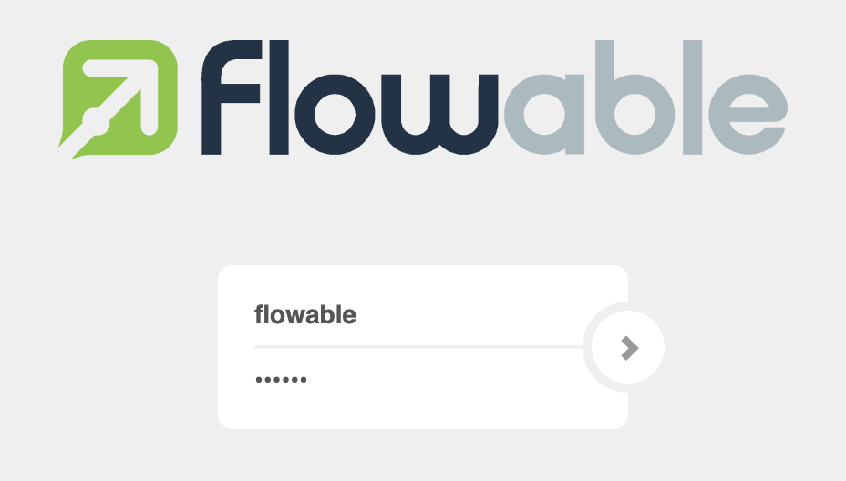
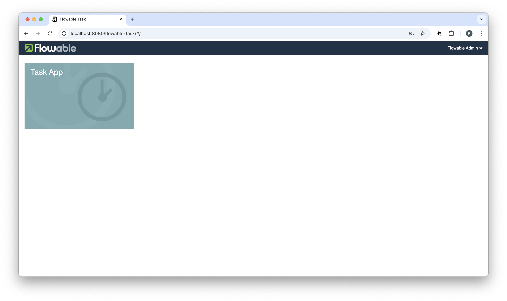

<h1 align="center">Working with Flowable's Web Applications</h1>

## ❯ Flowable's Web Applications

The [flowable/all-in-one](https://hub.docker.com/r/flowable/all-in-one) image includes Flowable's web applications:
- Flowable Identity Management
- Flowable Modeler
- Flowable Task
- Flowable Admin

With a single command, you can launch Flowable's web applications:

```
docker run --name flowable-all-in-one \
  -p 8080:8080 \
  --env-file ./flowable-all-in-one.env \
  flowable/all-in-one:6.5.0
```

Navigate to the Flowable Task application: http://localhost:8080/flowable-task and you will be redirected to Flowable's 
Identity Management application:

<p align="center">
  
</p>

Login using the default user-id: `flowable` and password: `Password12`

You should see something like:

<p align="center">
  
</p>

You can stop the container using the following command:

```
docker container stop flowable-all-in-one
```

You can remove the container using the following command:

```
docker container rm flowable-all-in-one
```

**Note**: The latest version of Flowable's Web Applications all-in-one im age is 6.5.0.
