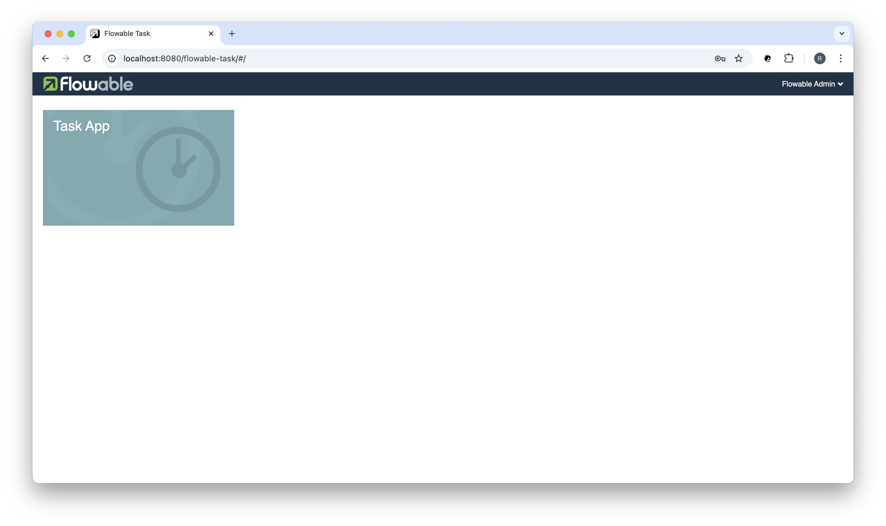

<h1 align="center">Working with Flowable</h1>

## ❯ Flowable all-in-one image

### Docker Compose

Using Docker Compose to launch Flowable is a straightforward process.

You need to specify an image, define environment variables for your Spring data source, volumes for persistent
storage, and port mapping for external access.

For example:

```
  serendipity-workflow-service:
    container_name: serendipity-workflow-service
    build:
      context: ./services/flowable
      dockerfile: Dockerfile
    restart: unless-stopped
    ports:
      - "8080:8080"
    environment:
      SPRING_DATASOURCE_DRIVER_CLASS_NAME: org.postgresql.Driver
      SPRING_DATASOURCE_URL: jdbc:postgresql://workflow-service-postgres:5432/${FLOWABLE_DB}
      SPRING_DATASOURCE_USERNAME: ${POSTGRES_USER}
      SPRING_DATASOURCE_PASSWORD: ${POSTGRES_PASSWORD}
      SPRING_JPA_DATABASE_PLATFORM: org.hibernate.dialect.PostgreSQLDialect
      SPRING_JPA_HIBERNATE_DDL_AUTO: create
    env_file:
      - '${PWD}/flowable-all-in-one-6-5-0.env'
    volumes:
      - '${PWD}/certs/keystore.p12:/keystore/keystore.p12'
    depends_on:
      - workflow-service-postgres
    networks:
      - backend
```

You also need to provide an 'env' file (e.g., `flowable-all-in-one-6-5-0.env`) to override Flowable's default settings.

For example:

```
spring.main.banner-mode=off
spring.jpa.open-in-view=false

# Logging
logging.level.root=INFO
logging.level.org.flowable=INFO
logging.level.org.hibernate.SQL=INFO

# Flowable Modeler App API Endpoint
flowable.modeler.app.deployment-api-url=http://host.docker.internal:8080/flowable-task/app-api

# Default Flowable Admin Accounts - See: 02-flowable.ldif
flowable.idm.app.admin.user-id=flowable
flowable.idm.app.admin.password=Password12
flowable.idm.app.admin.first-name=Flowable
flowable.idm.app.admin.last-name=Admin
flowable.idm.app.admin.email=flowable.admin@serendipity.org

flowable.common.app.idm-admin.user=flowable
flowable.common.app.idm-admin.password=Password12

# REST API - See: https://www.flowable.com/open-source/docs/bpmn/ch14-REST
# All REST-resources require a valid user with the rest-access-api privilege to be authenticated by default.
# If any valid user should be able to call the REST API, the 'flowable.rest.app.authentication-mode' can be set to 'any-user'.

flowable.rest.app.authentication-mode=any-user

# LDAP
# Server connection params
flowable.idm.ldap.enabled=true
# flowable.idm.ldap.server=ldap://localhost
flowable.idm.ldap.server=ldap://host.docker.internal
flowable.idm.ldap.port=389
flowable.idm.ldap.user=cn=admin,dc=serendipity,dc=org
flowable.idm.ldap.password=secret
# Query params
flowable.idm.ldap.base-dn=dc=serendipity,dc=org
flowable.idm.ldap.user-base-dn=ou=users,dc=serendipity,dc=org
flowable.idm.ldap.group-base-dn=ou=groups,dc=serendipity,dc=org
flowable.idm.ldap.query.user-by-id=(&(objectClass=inetOrgPerson)(uid={0}))
flowable.idm.ldap.query.user-by-full-name-like=(&(objectClass=inetOrgPerson)(|({0}=*{1}*)({2}=*{3}*)))
flowable.idm.ldap.query.all-users=(objectClass=inetOrgPerson)
flowable.idm.ldap.query.groups-for-user=(&(objectClass=groupOfUniqueNames)(uniqueMember={0}))
flowable.idm.ldap.query.all-groups=(objectClass=groupOfUniqueNames)
flowable.idm.ldap.query.group-by-id=(&(objectClass=groupOfUniqueNames)(uniqueId={0}))
# Attribute config
flowable.idm.ldap.attribute.user-id=uid
flowable.idm.ldap.attribute.first-name=cn
flowable.idm.ldap.attribute.last-name=sn
flowable.idm.ldap.attribute.email=mail
flowable.idm.ldap.attribute.group-id=cn
flowable.idm.ldap.attribute.group-name=cn
# Misc config
flowable.idm.ldap.cache.group-size=10000
```

## ❯ Flowable's Web Applications

The `flowable/all-in-one` image includes Flowable's web applications:

- Flowable Identity Management
- Flowable Modeler
- Flowable Task
- Flowable Admin

To launch a Flowable web application:

Flowable Modeler: http://localhost:8080/flowable-modeler
Flowable Task: http://localhost:8080/flowable-task
Flowable Admin: http://localhost:8080/flowable-admin
Flowable Identity Management: http://localhost:8080/flowable-idm

Navigate to the Flowable Task application: http://localhost:8080/flowable-task and you will be redirected to Flowable's 
Identity Management application:

<p align="center">
  
</p>

Login using the default user-id: `flowable` and password: `Password12`

You should see something like:

<p align="center">
  
</p>

**Note**: The latest version of Flowable's Web Applications all-in-one image is 6.5.0.
