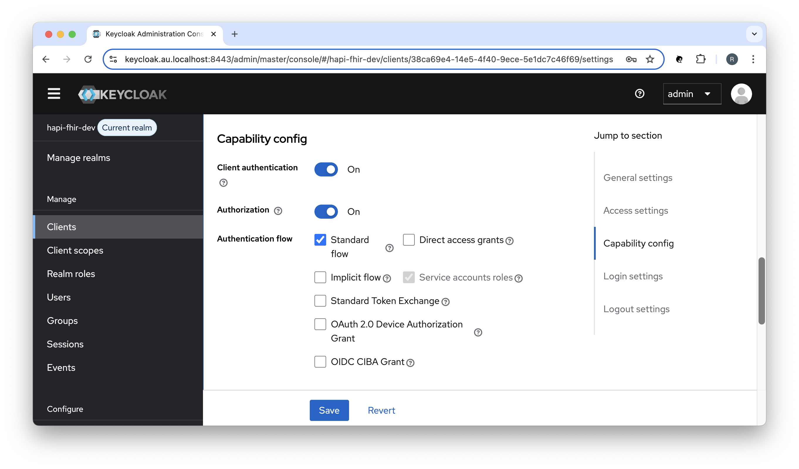
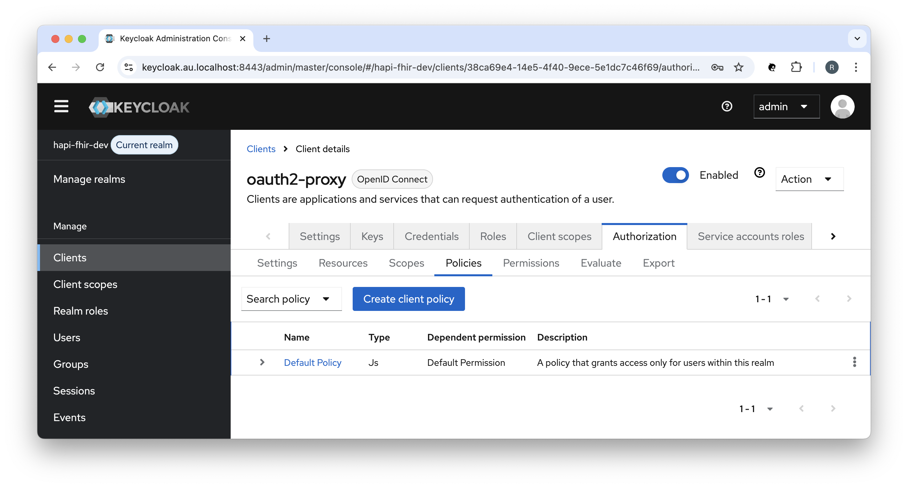
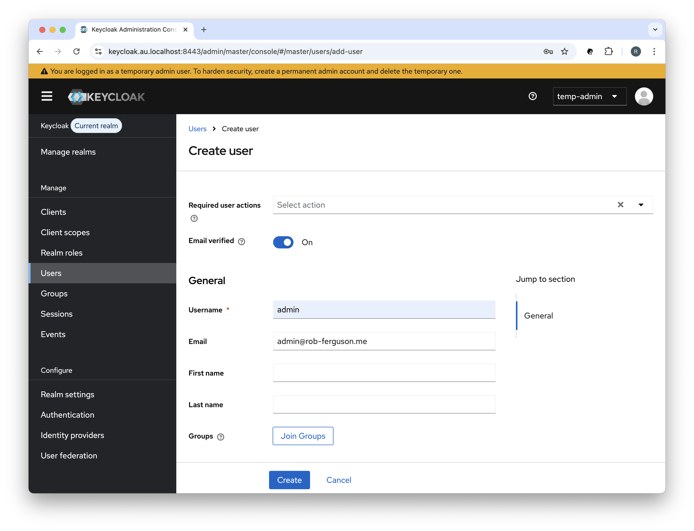
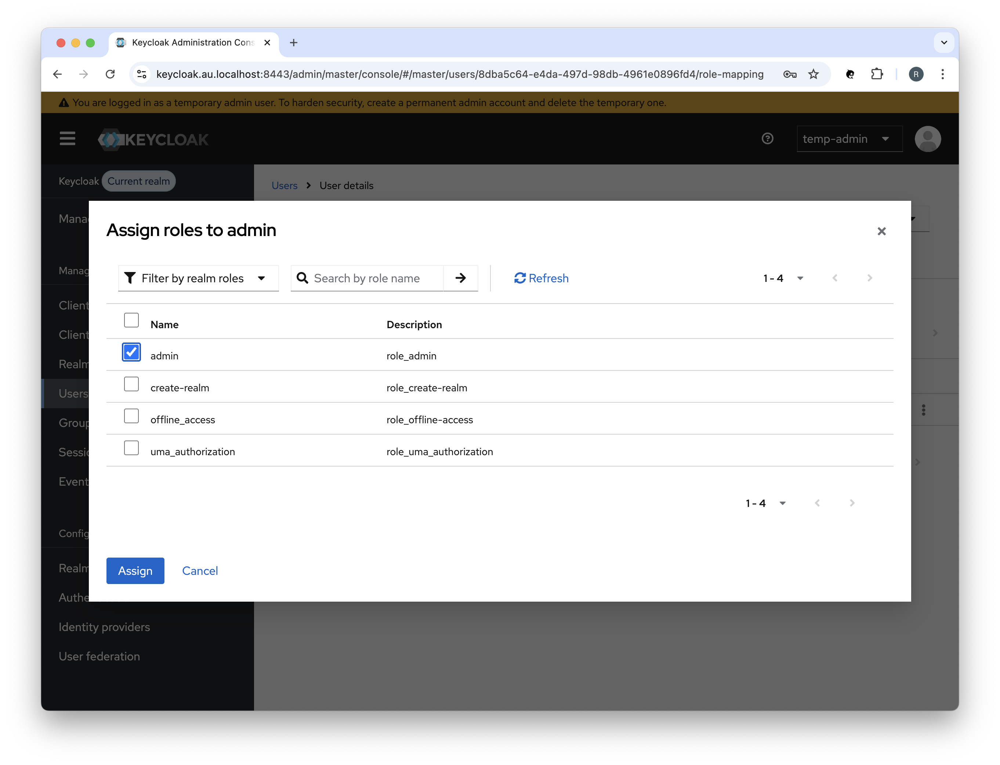
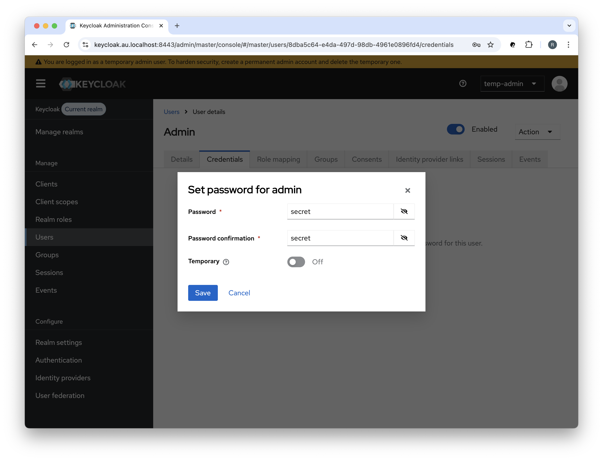

<h1 align="center">Working with Keycloak</h1>

## ❯ Keycloak

### Keycloak Authorization Services

#### Fine-grained Authorization

You must allow the 'Authorization' capability config setting in order to enable support for fine-grained authorisation.

<p align="center">
  
</p>

When you enable the 'Authorization' capability config setting, Keycloak will create a Default Policy:

<p align="center">
  
</p>

You need to **delete** the Default Policy if you want to 'export' then 'import' your realm settings.

See: [Keycloak Issues - ERROR: Script upload is disabled](https://github.com/keycloak/keycloak/discussions/28019)

### Permanent Admin Account

When you first start Keycloak you login using the Keycloak bootstrap username and password.

You should create a permanent admin account in the master realm and delete the temporary one.

For example:

<p align="center">
  
</p>

Don't forget to assign the admin role (role_admin) to the permanent admin account:

<p align="center">
  
</p>

And to set a password:

<p align="center">
  
</p>

### Importing and Exporting Realms

#### Import a Realm

Keycloak can import a realm when it starts up.

For example:

```
  keycloak.au.localhost:

    ...
    
    command:
      [
        'start-dev',
        '-Dkeycloak.migration.action=import',
        '-Dkeycloak.migration.provider=singleFile',
        '-Dkeycloak.migration.realmName=hapi-fhir-dev',
        '-Dkeycloak.migration.strategy=OVERWRITE_EXISTING',
        '-Dkeycloak.migration.file=/import/development-realm.json',
      ]
      
    ...
      
    volumes:
      - '${PWD}:/import'
```

#### Export a Realm

Keycloak can export a realm when it starts up.

For example:

```
  keycloak.au.localhost:

    ...
    
    command:
      [
        'start-dev',
        '-Dkeycloak.migration.action=export',
        '-Dkeycloak.migration.provider=singleFile',
        '-Dkeycloak.migration.realmName=hapi-fhir-dev',
        '-Dkeycloak.migration.usersExportStrategy=REALM_FILE',
        '-Dkeycloak.migration.file=/export/development-realm.json',
      ]
      
    ...
      
    volumes:
      - '${PWD}:/export'
```

## ❯ References

### Keycloak

* Keycloak docs: [Server Administration Guide - Importing and Exporting Realms](https://www.keycloak.org/server/importExport)
