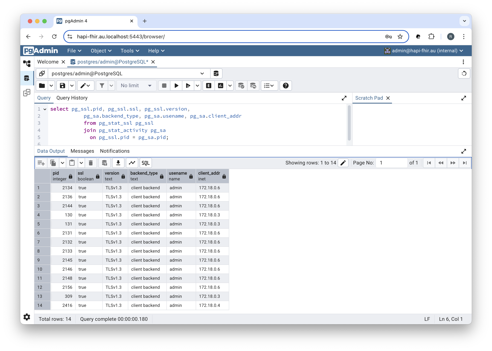

<h1 align="center">Working with the Percona Distribution for PostgreSQL</h1>

## ❯ Percona Distribution for PostgreSQL

### Docker Compose

Using Docker Compose to launch your PostgreSQL database and supporting services is a straightforward process.

You need to specify a PostgreSQL image, define environment variables for database credentials, volumes for persistent 
storage, and port mapping for external access.

For example:

```
services:

  postgres:
    container_name: postgres
    build:
      context: ./services/postgres
      dockerfile: Dockerfile
    ports:
      - 5432:5432
    environment:
      POSTGRES_DB: ${POSTGRES_DB}
      POSTGRES_USER: ${POSTGRES_USER}
      POSTGRES_PASSWORD: ${POSTGRES_PASSWORD}
    env_file:
      - ./.env
    volumes:
      - postgres_data:/var/lib/postgresql/data
  
    ...

```

See: [docker-compose-hapi-fhir-enable-tls.yml](https://github.com/Robinyo/hapi-fhir-au/blob/main/backend/docker-compose-hapi-fhir-enable-tls.yml)

### Secure data in transit

#### Enable TLS

Support for encrypted connections is enabled by setting the `ssl` parameter to `on`. The server will listen for both 
normal and secure connections on the same port. Connecting clients can be required to use encrypted connections by 
setting the environment variable `PGSSLMODE` to `require`.

PostgreSQL also requires access to the files containing the server certificate and private key. 

For example:

```
services:

  postgres:
    container_name: postgres
    
    ...
    
    command: >
      -c ssl=on 
      -c ssl_cert_file=/var/lib/postgresql/server.crt 
      -c ssl_key_file=/var/lib/postgresql/server.key
    environment:
      POSTGRES_DB: ${POSTGRES_DB}
      POSTGRES_USER: ${POSTGRES_USER}
      POSTGRES_PASSWORD: ${POSTGRES_PASSWORD}
      PGSSLMODE: require
    env_file:
      - ./.env      
    volumes:
      - '${PWD}/certs/cert.pem:/var/lib/postgresql/server.crt'
      - '${PWD}/certs/key.pem:/var/lib/postgresql/server.key'
      - postgres_data:/var/lib/postgresql/data
      
    ...

```

**Note:** On Unix and MacOS systems the cert and key file permissions must disallow any access to world or group.

For example:

```
sudo chmod 600 *.pem
```

We can check that connections to PostgreSQL are secure by running the following query:

```
select pg_ssl.pid, pg_ssl.ssl, pg_ssl.version,
       pg_sa.backend_type, pg_sa.usename, pg_sa.client_addr
       from pg_stat_ssl pg_ssl
       join pg_stat_activity pg_sa
       on pg_ssl.pid = pg_sa.pid;
```

In pgAdmin:

<p align="center">
  
</p>

We can obtain HAPI FHIR's IP Address using the following command:

```
docker inspect -f '{{range .NetworkSettings.Networks}}{{.IPAddress}}{{end}}' hapi-fhir
```

You should see something like:

```
172.18.0.6
```

### Secure data at rest

#### Enable encryption

The Docker image of the Percona Distribution for PostgreSQL includes the `pg_tde` extension that provides data encryption.

```
  postgres:
    container_name: postgres
    image: percona/percona-distribution-postgresql:17.5
         
    ...

    environment:
      ENABLE_PG_TDE: 1
      
      ...

```

See: [docker-compose.yml](https://github.com/Robinyo/hapi-fhir-au/blob/main/backend/docker-compose-hapi-fhir-enable-tls.yml)

`ENABLE_PG_TDE: 1` adds `pg_tde` to the `shared_preload_libraries` entry in the `postgresql.conf` file and enables the custom storage manager.

Connect to the container:

```
docker exec -it postgres bash
```

Start an interactive `psql` session:

```
psql -U admin -d hapi-fhir
```

Create the `pg_tde` extension in the database you want to encrypt:

```
\c hapi-fhir;
CREATE EXTENSION pg_tde;
```

Check the list of installed extensions:

```
hapi-fhir=# \dx
                 List of installed extensions
  Name   | Version |   Schema   |         Description          
---------+---------+------------+------------------------------
 pg_tde  | 1.0-rc  | public     | pg_tde access method
 plpgsql | 1.0     | pg_catalog | PL/pgSQL procedural language
(2 rows)
```

Configure a key provider:


```
SELECT pg_tde_add_database_key_provider_file('file-vault', '/tmp/pg_tde_test_001_basic.per');
```

You should see something like:

```
 pg_tde_add_database_key_provider_file 
---------------------------------------
                                     1
(1 row)
```

**Note:** This sample key provider configuration is meant for development and testing purposes only, not production.

Set a principal key:

```
SELECT pg_tde_set_key_using_database_key_provider('test-db-key', 'file-vault');
```

You should see something like:

```
 pg_tde_set_key_using_database_key_provider 
--------------------------------------------
 
(1 row)
```

Alter a table to enable encryption:

```
ALTER TABLE hfj_resource SET ACCESS METHOD tde_heap;
```

You should see something like:

```
ALTER TABLE
```

Check to see if the table is encrypted:

```
select pg_tde_is_encrypted('hfj_resource');
```

You should see something like:

```
 pg_tde_is_encrypted 
---------------------
 t
(1 row)
```

End your interactive `psql` session:

```
\q
```

## ❯ References

### PostgreSQL

* Percona Distribution for PostgreSQL: [Docker](https://docs.percona.com/postgresql/17/docker.html)
* Percona Community Forum: [pg_tde](https://forums.percona.com/c/postgresql/pg-tde-transparent-data-encryption-tde/82)
* GitHub: [Percona PostgreSQL - Test Case 001](https://github.com/percona/postgres/blob/TDE_REL_17_STABLE/contrib/pg_tde/t/001_basic.pl)
