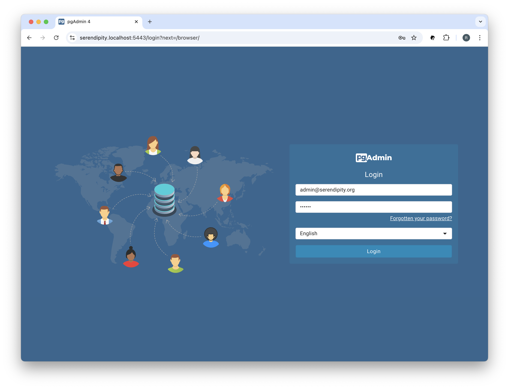
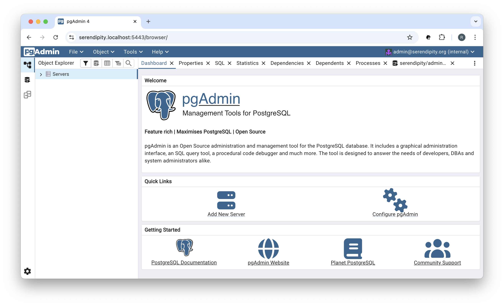
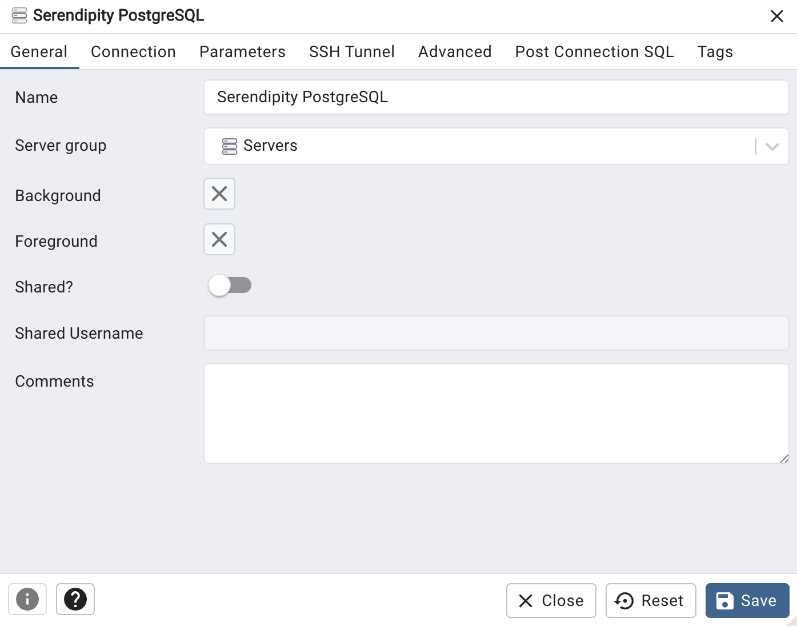
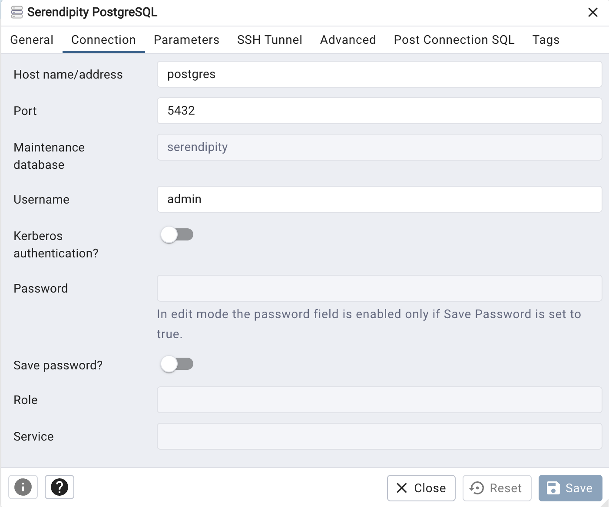

<h1 align="center">Working with pgAdmin</h1>

## ❯ pgAdmin

You can use [pgAdmin](https://www.pgadmin.org/) to manage PostrgeSQL.

Navigate to the pgAdmin Login page: https://hapi-fhir.au.localhost:5443

  

Login using the PGADMIN_DEFAULT_EMAIL (admin@hapi-fhir.au) and PGADMIN_DEFAULT_PASSWORD (secret) credentials.

You should see something like:

  

In the 'Quick Links' click on 'Add New Server':

  

Enter the Name (HAPI FHIR PostgreSQL) and then click on the 'Connection' tab:

  

Enter the Host name / address (postgres) and the PostgreSQL Username (POSTGRES_USER=admin) and Password (POSTGRES_PASSWORD=secret), 
the Maintenance database (hapi-fhir) then click the 'Save' button:

**Note:** The 'Host name / address' field must match the value (e.g., postgres) specified in the project's docker-compose.yml.

## ❯ References

### pgAdmin

* pgAdmin: [Documentation](https://www.pgadmin.org/docs/pgadmin4/latest/index.html)
