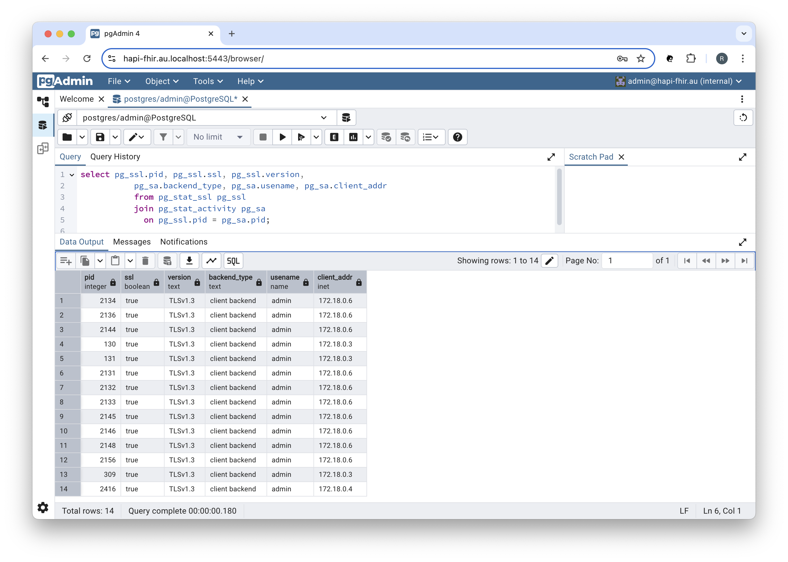

<h1 align="center">Working with PostgreSQL</h1>

## ❯ PostgreSQL

### Docker Compose

Using Docker Compose to launch your PostgreSQL database and supporting services is a straightforward process.

You need to specify a PostgreSQL image, define environment variables for database credentials, volumes for persistent 
storage, and port mapping for external access.

For example:

```
services:

  postgres:
    container_name: postgres
    build:
      context: ./services/postgres
      dockerfile: Dockerfile
    ports:
      - 5432:5432
    environment:
      POSTGRES_DB: ${POSTGRES_DB}
      POSTGRES_USER: ${POSTGRES_USER}
      POSTGRES_PASSWORD: ${POSTGRES_PASSWORD}
    env_file:
      - ./.env
    volumes:
      - postgres_data:/var/lib/postgresql/data
  
    ...

```

See: [docker-compose-apisix.yml](https://github.com/Robinyo/hapi-fhir-au/blob/main/backend/docker-compose-apisix.yml)

### Secure data in transit

#### Enable TLS

Support for encrypted connections is enabled by setting the `ssl` parameter to `on`. The server will listen for both 
normal and secure connections on the same port. Connecting clients can be required to use encrypted connections by 
setting the environment variable `PGSSLMODE` to `require`.

PostgreSQL also requires access to the files containing the server certificate and private key. 

For example:

```
services:

  postgres:
    container_name: postgres
    
    ...
    
    command: >
      -c ssl=on 
      -c ssl_cert_file=/var/lib/postgresql/server.crt 
      -c ssl_key_file=/var/lib/postgresql/server.key
    environment:
      POSTGRES_DB: ${POSTGRES_DB}
      POSTGRES_USER: ${POSTGRES_USER}
      POSTGRES_PASSWORD: ${POSTGRES_PASSWORD}
      PGSSLMODE: require
    env_file:
      - ./.env      
    volumes:
      - '${PWD}/certs/cert.pem:/var/lib/postgresql/server.crt'
      - '${PWD}/certs/key.pem:/var/lib/postgresql/server.key'
      - postgres_data:/var/lib/postgresql/data
      
    ...

```

**Note:** On Unix and MacOS systems the cert and key file permissions must disallow any access to world or group.

For example:

```
sudo chmod 600 *.pem
```

We can check that the connections to PostgreSQL are secure by running the following query:

```
select pg_ssl.pid, pg_ssl.ssl, pg_ssl.version,
       pg_sa.backend_type, pg_sa.usename, pg_sa.client_addr
       from pg_stat_ssl pg_ssl
       join pg_stat_activity pg_sa
       on pg_ssl.pid = pg_sa.pid;
```

In pgAdmin:

<p align="center">
  
</p>

We can obtain HAPI FHIR's IP Address using the following command:

```
docker inspect -f '{{range .NetworkSettings.Networks}}{{.IPAddress}}{{end}}' hapi-fhir
```

You should see something like:

```
172.18.0.6
```

## ❯ References

### PostgreSQL

* PostgreSQL: [Documentation](https://www.postgresql.org/docs/current/index.html)
