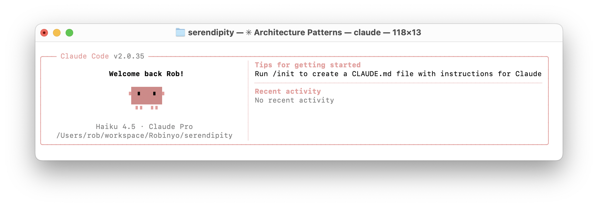

<h1 align="center">Claude Code</h1>

## ❯ Getting started

Install Claude Code:

```
brew install --cask claude-code
```

Start using Claude Code:

```
cd ~/workspace/serendipty
claude
```

You should see something like:

<p align="center">
  
</p>

## ❯ Codebase Overview

Serendipity 3.0 is an open-source Customer Engagement Platform (CRM) with a full-stack architecture combining an Angular PWA frontend with Spring Boot
microservices backend.

Key Highlights:

Frontend Stack:
- Angular 20 with Material Design 3
- Multi-project workspace with shared component libraries (party, auth, workflow, dynamic-forms, etc.)
- Progressive Web App (offline-capable, installable)
- TypeScript + RxJS for state management

Backend Stack:
- Spring Boot 3.5.5 with Java 21
- Backend for Frontend (BFF) pattern using Spring Cloud Gateway
- Microservices architecture (Party Service, Workflow Service)
- PostgreSQL database
- Flowable for BPMN workflow automation

Architecture:
- Monorepo structure with /frontend and /backend folders
- OAuth 2.0 + OpenID Connect authentication via Keycloak
- Docker Compose for containerized local development
- Multi-service setup: API Gateway, Party Service, Workflow Engine, Identity Management (Keycloak/LDAP)

Core Features:
- Customer/party management (individuals, organisations, contacts)
- Workflow and task automation (BPMN, DMN, CMMN)
- Real-time engagement tracking
- Electoral division mapping
- Responsive UI with command bar and sidenav navigation

Technologies: Angular, Spring Boot, PostgreSQL, Flowable, Keycloak, Docker, Maven, RxJS, Material Design

The project emphasizes security (OAuth 2.0, TLS, AES encryption), scalability (microservices, Spring Cloud), and UX (PWA, offline-first, responsive
design).

## ❯ Architecture Patterns Summary

Here are the main architecture patterns used in Serendipity:

1. Backend for Frontend (BFF) Pattern

- Spring Cloud Gateway acts as a single entry point (port 8080) for the frontend
- Routes requests to backend microservices based on URL predicates
- Handles CORS, session management, and OAuth2 infrastructure (ready but not currently enabled)
- Serves the compiled Angular PWA static files

2. Microservices Architecture

- Independent services: Party Service (contacts/accounts), Workflow Service (Flowable)
- Each service has its own PostgreSQL database
- Services communicate via HTTP/REST
- Enables independent deployment and scaling

3. Repository/DAO + JPA Pattern

- Spring Data JPA repositories auto-generate database queries
- Aggregate root design: Party is the root entity with Individual and Organisation as specializations
- Sequence-based primary keys, indexed fields for performance
- Embedded value objects (Name, Address)
- Built-in auditing (createdBy, createdAt, updatedBy, updatedAt)

4. REST API Design (Spring Data REST + HATEOAS)

- Auto-generated REST endpoints from repositories
- Assembler pattern transforms JPA entities to response DTOs
- HATEOAS links for resource discovery
- Paging and sorting via Spring Data's Pageable
- Relationship endpoints (e.g., /individuals/{id}/roles)

5. Angular Standalone Components + Feature Libraries

- Standalone components (Angular 14+) with lazy loading
- Feature libraries (serendipity-party-lib, serendipity-workflow-lib, etc.) export composable routes
- Zone-less change detection for performance
- RxJS observables for async data management

6. Service Layer + Adapter Pattern

- Abstract base service (AbstractCollectionService) with HTTP client configuration
- Adapters transform raw API responses into strongly-typed models
- Services handle dependency injection and data transformation
- Smart/Dumb components: Smart components manage state, dumb components are purely presentational

7. Route Resolvers for Data Pre-fetching

- Route guards fetch data before components load
- Form definitions and metadata pre-loaded via resolvers
- Reduces loading states and improves UX

8. Workflow Integration (Flowable as Separate Service)

- Flowable BPMN engine runs as a containerized microservice
- Isolated database for workflow state
- Frontend facade service (ActivitiesService) abstracts workflow complexity

9. Docker Compose Orchestration

- Containerized services with service discovery via Docker networking
- Multi-service topology: BFF gateway → Microservices → PostgreSQL
- Reproducible local development environment
- Alpine-based Docker images for minimal size

10. Data Model - Aggregate Root Pattern

- Party is the aggregate root managing Individual, Organisation, Addresses, Roles
- Composite keys using @MapsId for relationships
- Many-to-Many relationships with join tables
- Complete audit trail on all changes

These patterns combine to create a scalable, maintainable, enterprise-grade CRM platform with clear separation of concerns, type safety, and modern
frontend/backend best practices.

## ❯ References

* Claude Code docs: [Getting started](https://code.claude.com/docs/en/overview#homebrew)
* Claude Code docs: [Common workflows](https://code.claude.com/docs/en/tutorials#get-a-quick-codebase-overview)
