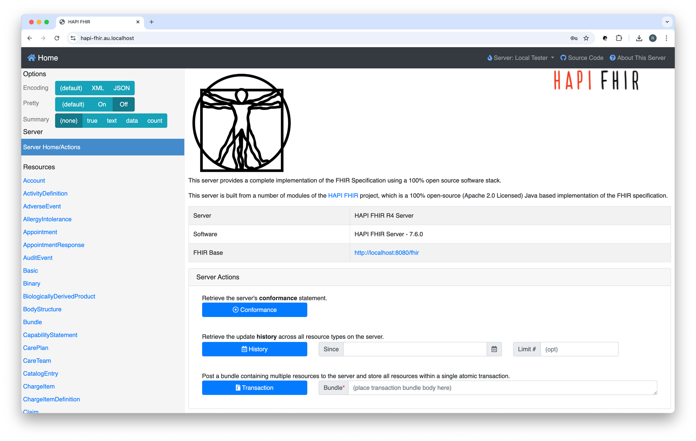
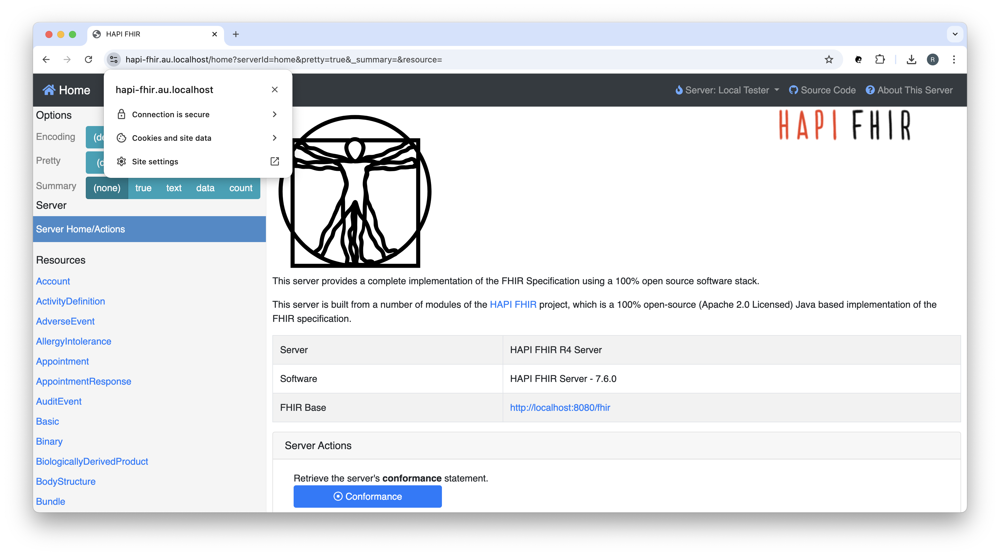
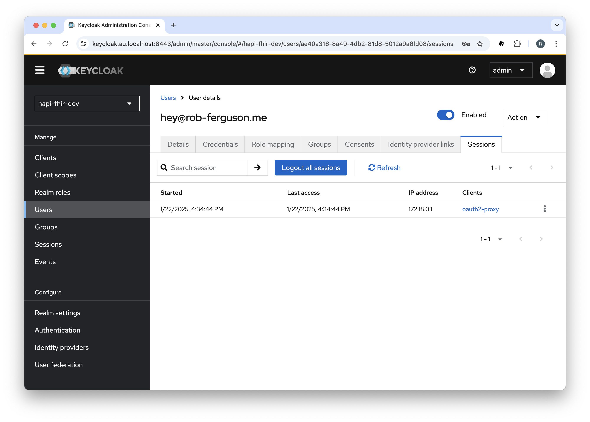
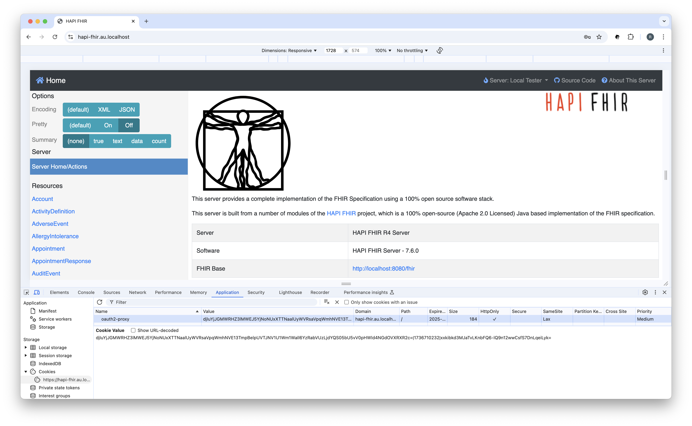
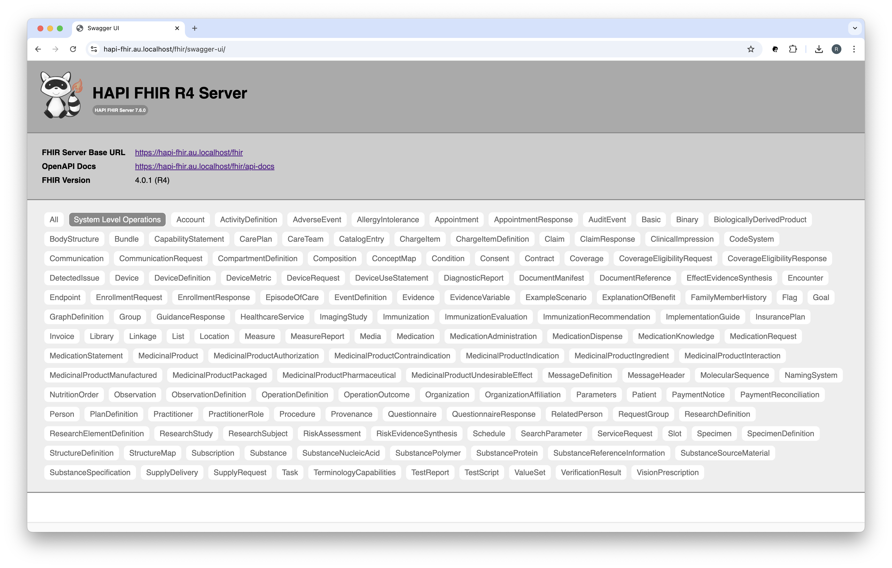
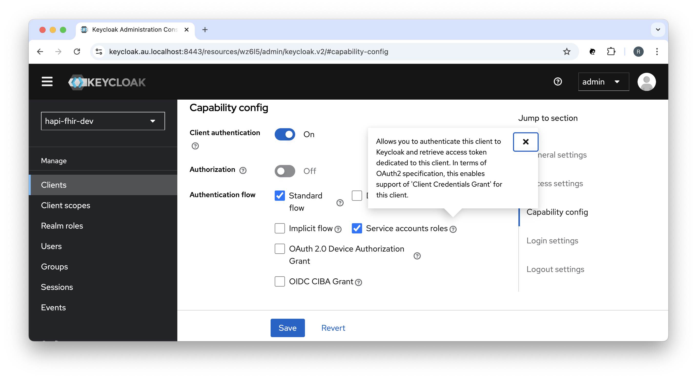
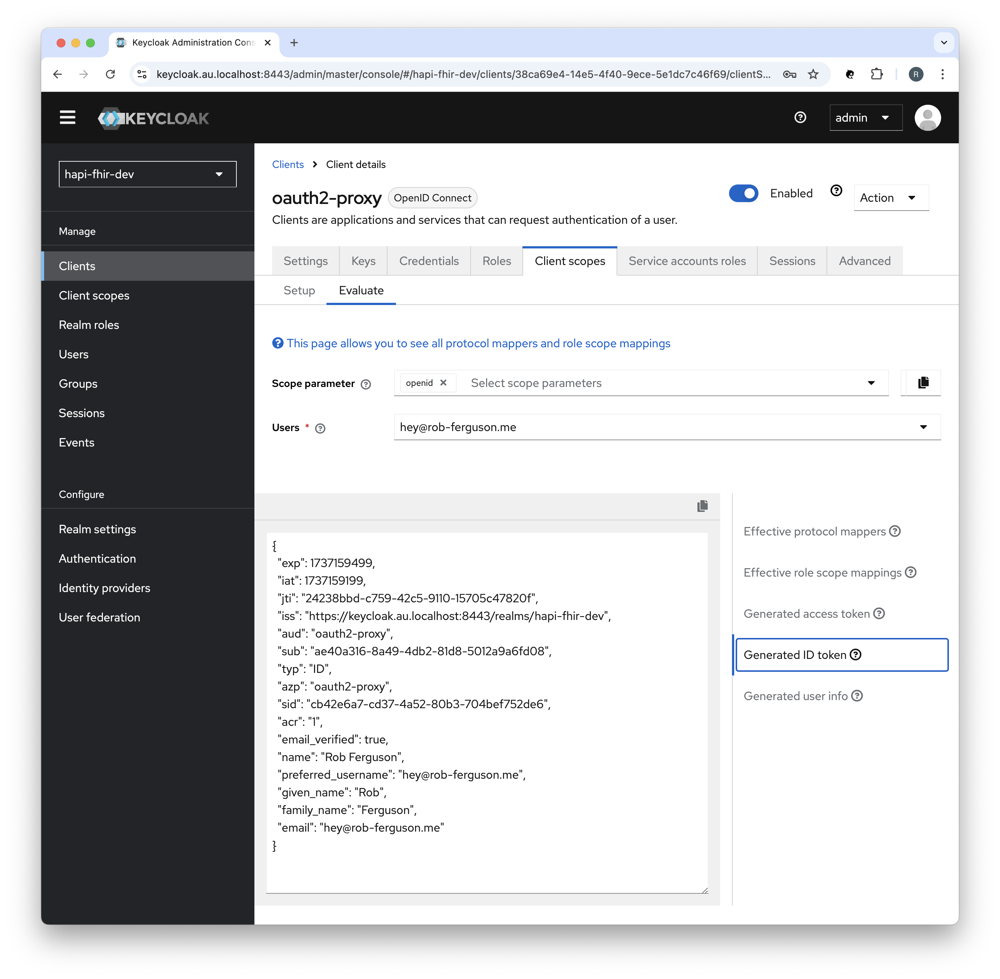
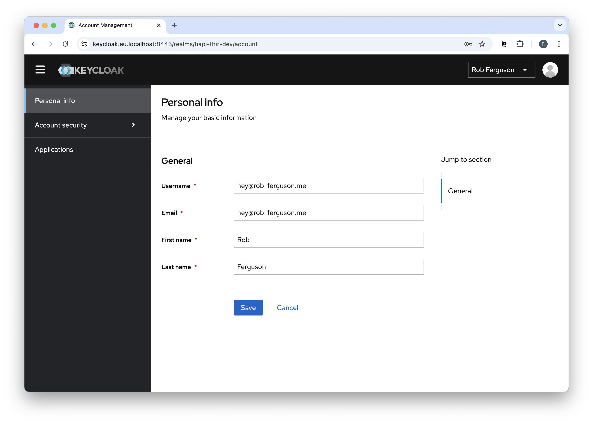

<h1 align="center">Quick Start Guide</h1>

### Clone the project

Change the current working directory to the location where you want the cloned project to be:

```
cd ~/workspace
```

Clone the project by running the following command:

```
git clone git@github.com:Robinyo/hapi-fhir-au.git
``` 

### Enable TLS

#### Local Development

Follow the steps in the project's Developer Documentation to use [mkcert](../mkcert/README.md) to create and install a 
local certificate authority and to generate the certificates required to enable TLS.

### Docker Compose

With a single command, you can create and start all the services:

```
cd ~/workspace/hapi-fhir-au/backend

# APISIX
docker compose -f docker-compose-apisix.yml up

# OR

# Nginx
docker compose -f docker-compose-nginx.yml up
```

**Note:** Docker Compose will look for an `.env` file in the current working directory.

Navigate to:

```
https://hapi-fhir.au.localhost
```

You should see something like:

<p align="center">
  
</p>

Enter your username (hey@rob-ferguson.me) and password (secret), then click the 'Sign In' button to sign in using the OpenID Connect (OIDC) **Authorization Code flow**.

**Note:** I followed the steps in Keycloak's [Getting Started with Docker](https://www.keycloak.org/getting-started/getting-started-docker) guide to create: a realm; a user; and a client.
Keycloak will import the `hapi-fhir-dev` realm (i.e., development-realm.json) when it starts up.

<p align="center">
  
</p>

Your connection is secure:

<p align="center">
  
</p>

#### Sign out

In the Keycloak Admin Console you can sign out of the session:

<p align="center">
  
</p>

Using the browser's Developer Tools you can clear the session cookie:

<p align="center">
  
</p>

The user will be prompted to Sign in again:

<p align="center">
  
</p>

#### OpenAPI (Swagger)

Navigate to the OpenAPI (Swagger) UI for the HAPI FHIR R4 Server:

```
https://hapi-fhir.au.localhost/fhir
```

You should see something like:

<p align="center">
  
</p>

**Note:** You can override the default FHIR Server Base URL, for example:

```
hapi:
  fhir:
    server_address: https://hapi-fhir.au.localhost/fhir
```

See: [hapi.application.yaml](https://github.com/Robinyo/hapi-fhir-au/blob/main/backend/hapi.application.yaml)

To stop the services:

```
# APISIX
docker compose -f docker-compose-apisix.yml stop

# Nginx
docker compose -f docker-compose-nginx.yml stop
```

To remove the services:

```
# APISIX
docker compose -f docker-compose-apisix.yml down

# Nginx
docker compose -f docker-compose-nginx.yml down
```

To remove the data volumes:

```
docker volume rm backend_postgres_data
docker volume rm backend_cache
```

### Call the HAPI FHIR API

##### OAuth 2.0 Client Credentials Grant

You must allow the 'Service account roles' capability config setting in order to enable support for the OAuth 2.0 **Client Credentials grant**:

<p align="center">
  
</p>

#### Request a token

To access the API, you must request an access token. You will need to POST to the token URL.

For example (`scope=system/Patient.read`):

```
ACCESS_TOKEN=$(curl -s -X POST https://keycloak.au.localhost:8443/realms/hapi-fhir-dev/protocol/openid-connect/token \
  -H 'content-type: application/x-www-form-urlencoded' \
  -d grant_type=client_credentials \
  -d client_id=oauth2-proxy \
  -d client_secret=aHkRec1BYkfaKgMg164JmvKu8u9iWNHM \
  -d scope=system/Patient.read | (jq -r '.access_token'))
                 
# echo "$ACCESS_TOKEN"                 
```

or for example (`scope=system/Organization.read`):

```
ACCESS_TOKEN=$(curl -s -X POST https://keycloak.au.localhost:8443/realms/hapi-fhir-dev/protocol/openid-connect/token \
  -H 'content-type: application/x-www-form-urlencoded' \
  -d grant_type=client_credentials \
  -d client_id=oauth2-proxy \
  -d client_secret=aHkRec1BYkfaKgMg164JmvKu8u9iWNHM \
  -d scope=system/Organization.read | (jq -r '.access_token'))
                 
# echo "$ACCESS_TOKEN"                 
```

**Note:** You can use [jwt.io](https://jwt.io/) to decode the access token.

#### Introspect a token

To introspect an Access Token you will need to POST to the introspect URL.

For example:

```
curl -X POST "https://keycloak.au.localhost:8443/realms/hapi-fhir-dev/protocol/openid-connect/token/introspect" \
  -H 'content-type: application/x-www-form-urlencoded' \
  -d client_id=oauth2-proxy \
  -d client_secret=aHkRec1BYkfaKgMg164JmvKu8u9iWNHM \
  -d "token_type_hint=access_token&token=$ACCESS_TOKEN"
```

#### Call the API

To call the API, an application must pass the access token as a Bearer token in the Authorization header of the HTTP request.

For example:

```
curl -X GET https://hapi-fhir.au.localhost/fhir/Patient?_id=baratz-toni \
  -H 'Content-Type: application/fhir+json' \
  -H "Authorization: Bearer $ACCESS_TOKEN"
```

You should see something like:

```
{
  "resourceType": "Bundle",
  "id": "9d80c83a-0b06-4b78-bce2-21e6666348d8",
  "meta": {
    "lastUpdated": "2025-05-23T05:43:01.959+00:00"
  },
  "type": "searchset",
  "total": 1,
  "link": [ {
    "relation": "self",
    "url": "https://hapi-fhir.au.localhost/fhir/Patient?_id=baratz-toni"
  } ],
  "entry": [ {
    "fullUrl": "https://hapi-fhir.au.localhost/fhir/Patient/baratz-toni",
    "resource": {
      "resourceType": "Patient",
      "id": "baratz-toni",
      "meta": {
        "versionId": "1",
        "lastUpdated": "2025-05-23T05:42:36.551+00:00",
        "source": "#rKTCeZfmnReSjm8X",
        "profile": [ "http://hl7.org.au/fhir/core/StructureDefinition/au-core-patient" ]
      },
      "extension": [ {
        "url": "http://hl7.org.au/fhir/StructureDefinition/indigenous-status",
        "valueCoding": {
          "system": "https://healthterminologies.gov.au/fhir/CodeSystem/australian-indigenous-status-1",
          "code": "1",
          "display": "Aboriginal but not Torres Strait Islander origin"
        }
      }, {
        "url": "http://hl7.org/fhir/StructureDefinition/individual-genderIdentity",
        "extension": [ {
          "url": "value",
          "valueCodeableConcept": {
            "coding": [ {
              "system": "http://snomed.info/sct",
              "code": "446141000124107",
              "display": "Identifies as female gender"
            } ]
          }
        } ]
      }, {
        "url": "http://hl7.org/fhir/StructureDefinition/individual-pronouns",
        "extension": [ {
          "url": "value",
          "valueCodeableConcept": {
            "coding": [ {
              "system": "http://loinc.org",
              "code": "LA29519-8",
              "display": "she/her/her/hers/herself"
            } ]
          }
        } ]
      }, {
        "url": "http://hl7.org/fhir/StructureDefinition/individual-recordedSexOrGender",
        "extension": [ {
          "url": "type",
          "valueCodeableConcept": {
            "coding": [ {
              "system": "http://snomed.info/sct",
              "code": "1515311000168102",
              "display": "Biological sex at birth"
            } ]
          }
        }, {
          "url": "value",
          "valueCodeableConcept": {
            "coding": [ {
              "system": "http://snomed.info/sct",
              "code": "248152002",
              "display": "Female"
            } ]
          }
        } ]
      } ],
      "identifier": [ {
        "extension": [ {
          "url": "http://hl7.org.au/fhir/StructureDefinition/ihi-status",
          "valueCoding": {
            "system": "https://healthterminologies.gov.au/fhir/CodeSystem/ihi-status-1",
            "code": "active"
          }
        }, {
          "url": "http://hl7.org.au/fhir/StructureDefinition/ihi-record-status",
          "valueCoding": {
            "system": "https://healthterminologies.gov.au/fhir/CodeSystem/ihi-record-status-1",
            "code": "verified",
            "display": "verified"
          }
        } ],
        "type": {
          "coding": [ {
            "system": "http://terminology.hl7.org/CodeSystem/v2-0203",
            "code": "NI"
          } ],
          "text": "IHI"
        },
        "system": "http://ns.electronichealth.net.au/id/hi/ihi/1.0",
        "value": "8003608000311662"
      }, {
        "type": {
          "coding": [ {
            "system": "http://terminology.hl7.org/CodeSystem/v2-0203",
            "code": "MC"
          } ],
          "text": "Medicare Number"
        },
        "system": "http://ns.electronichealth.net.au/id/medicare-number",
        "value": "69518252411"
      } ],
      "name": [ {
        "use": "official",
        "family": "BARATZ",
        "given": [ "Toni" ]
      } ],
      "telecom": [ {
        "system": "phone",
        "value": "0870101270",
        "use": "home"
      }, {
        "system": "phone",
        "value": "0491570156",
        "use": "mobile"
      }, {
        "system": "phone",
        "value": "0870108006",
        "use": "work"
      } ],
      "gender": "female",
      "birthDate": "1978-06-16",
      "address": [ {
        "line": [ "24 Law Cir" ],
        "city": "Bassendean",
        "state": "WA",
        "postalCode": "6054",
        "country": "AU"
      } ]
    },
    "search": {
      "mode": "match"
    }
  } ]
}             
```

or for example:

```
curl -X GET https://hapi-fhir.au.localhost/fhir/Organization?_id=adv-hearing-care \
  -H 'Content-Type: application/fhir+json' \
  -H "Authorization: Bearer $ACCESS_TOKEN"
```

You should see something like:

```
{
  "resourceType": "Bundle",
  "id": "d049517a-9ff0-47e3-a3ff-c19f3d7615a6",
  "meta": {
    "lastUpdated": "2025-06-12T01:19:04.156+00:00"
  },
  "type": "searchset",
  "total": 1,
  "link": [ {
    "relation": "self",
    "url": "https://hapi-fhir.au.localhost/fhir/Organization?_id=adv-hearing-care"
  } ],
  "entry": [ {
    "fullUrl": "https://hapi-fhir.au.localhost/fhir/Organization/adv-hearing-care",
    "resource": {
      "resourceType": "Organization",
      "id": "adv-hearing-care",
      "meta": {
        "versionId": "1",
        "lastUpdated": "2025-06-12T01:18:33.852+00:00",
        "source": "#CVStmTGW0vAqtHXS",
        "profile": [ "http://hl7.org.au/fhir/core/StructureDefinition/au-core-organization" ]
      },
      "identifier": [ {
        "type": {
          "coding": [ {
            "system": "http://terminology.hl7.org/CodeSystem/v2-0203",
            "code": "XX"
          } ],
          "text": "ABN"
        },
        "system": "http://hl7.org.au/id/abn",
        "value": "12345678901"
      } ],
      "active": true,
      "name": "Audiology Advanced Hearing Care",
      "telecom": [ {
        "system": "email",
        "value": "info@ahc.example.com",
        "use": "work"
      } ]
    },
    "search": {
      "mode": "match"
    }
  } ]
}
```

### Keycloak

#### Admin Console

To navigate to the Keycloak Admin Console (username: temp-admin and password: secret):

```
https://keycloak.au.localhost:8443
```

You should see something like:

<p align="center">
  
</p>

Follow these [steps](../../administrator/keycloak/README.md) to create a permanent admin account.

You can preview tokens in the Keycloak Admin Console, for example:

<p align="center">
  
</p>

#### Account Console

To navigate to the Keycloak Account Console:

```
https://keycloak.au.localhost:8443/realms/hapi-fhir-dev/account
```

You should see something like:

<p align="center">
  
</p>
