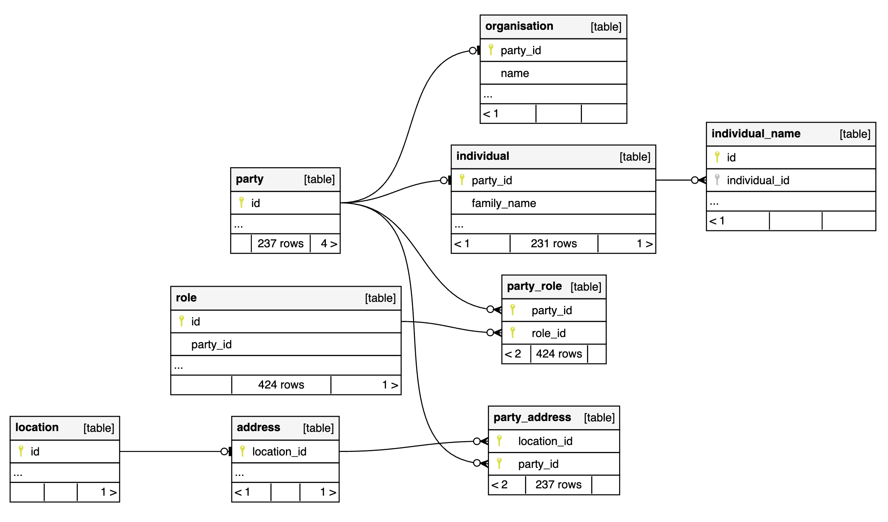

<h1 align="center">SchemaSpy</h1>

## ❯ Introduction

The Entity Relationship (ER) diagram generator.

### Configuration

schemaspy.properties:

```
# type of database. Run with -dbhelp for details
# if mssql doesn't work: try mssql08 in combination with sqljdbc_7.2, this combination has been tested
schemaspy.t=pgsql11
# optional path to alternative jdbc drivers.
schemaspy.dp=postgresql-42.7.8.jar
# database properties: host, port number, name user, password
schemaspy.host=localhost
schemaspy.port=5432
schemaspy.db=serendipity
schemaspy.u=admin
schemaspy.p=secret
# output dir to save generated files
schemaspy.o=./docs
# db scheme for which generate diagrams
schemaspy.s=public
```

### Running SchemaSpy

You can run SchemaSpy from the command line:

```
java -jar schemaspy-app.jar -vizjs
```

Sample diagram:

<p align="center">
  
</p>

## ❯ References

* Website: [SchemaSpy](https://schemaspy.org/)
