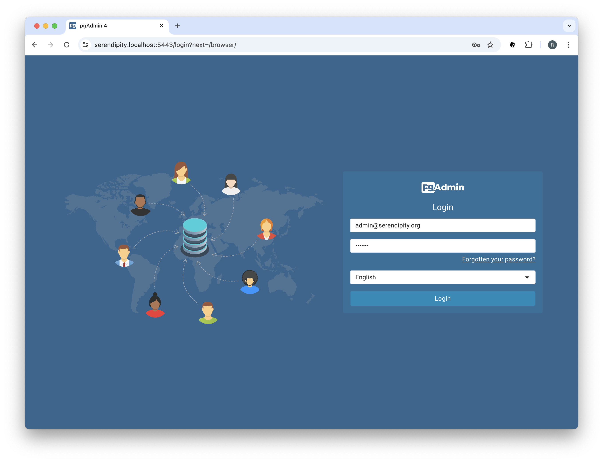
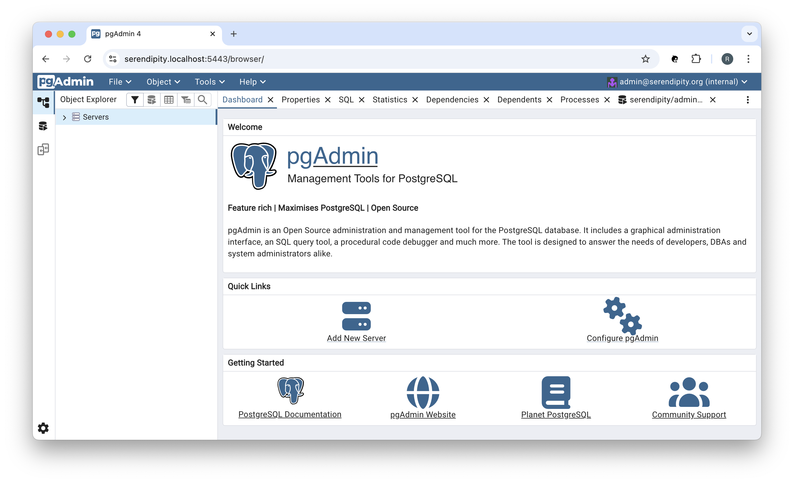

# pgAdmin

You can use [pgAdmin](https://www.pgadmin.org/) to manage PostrgeSQL.

Navigate to the pgAdmin Login page: https://serendipity.localhost:5443

Login using the PGADMIN_DEFAULT_EMAIL (admin@serendipity.org) and PGADMIN_DEFAULT_PASSWORD (secret) credentials.

You should see something like:

In the 'Quick Links' click on 'Add New Server':

  

 
Enter the Name (Serendipity Storage Service) and then click on the 'Connection' tab:

  

 
Enter the Host name / address (serendipity-storage-service) and the Username (SERENDIPITY_STORAGE_SERVICE_USER=admin) 
and Password (SERENDIPITY_STORAGE_SERVICE_PASSWORD=secret), and the Maintenance database (serendipity) then click the 'Save' button:

:::tip

The 'Host name / address' field must match the value (e.g., serendipity-storage-service) specified in the project's  `docker-compose.yml`.

:::

## References

### pgAdmin

* pgAdmin: [Documentation](https://www.pgadmin.org/docs/pgadmin4/latest/index.html)
