```mermaid
flowchart TB
    %% Styling
    classDef ceo fill:#4a8fe7,color:#fff,stroke:#2a5fa8
    classDef director fill:#6c5ce7,color:#fff,stroke:#4a3cb5
    classDef manager fill:#00b894,color:#fff,stroke:#008a6e
    classDef consultant fill:#fdcb6e,color:#1a1a2e,stroke:#c49a34
    classDef analyst fill:#dfe6e9,color:#1a1a2e,stroke:#b0b3b8
    classDef system fill:#999,color:#fff,stroke:#666

    subgraph Federal_Affairs ["Federal Affairs — led by Lee Wolf"]
        direction TB
        LW["`**Lee Wolf**<br/>Director, Federal Affairs<br/>(Senior Manager)`"]:::director
        DC["`**Declan McConnachie**<br/>Consultant, Federal Affairs<br/>(Consultant)`"]:::consultant
        SN["`**Sirkka Nieminen**<br/>Consultant, Federal Affairs<br/>(Consultant)`"]:::consultant
        CE["`**Chas Ewell**<br/>Associate Analyst, Federal Affairs<br/>(Analyst)`"]:::analyst

        LW --> DC
        LW --> SN
        LW --> CE
    end

    subgraph Strategic_Comms ["Strategic Communications & Operations — led by Leonard Ansen"]
        direction TB
        LA["`**Leonard Ansen**<br/>Director, Strategic Communications<br/>(Senior Manager)`"]:::director
        ML["`**Max Lubin**<br/>Head of Business Development<br/>(Manager)`"]:::manager
        WF["`**Wendy Foley**<br/>Head of Client Management<br/>(Manager)`"]:::manager
        MH["`**Michelle Hauptmann**<br/>Consultant, Strategic Communications<br/>(Consultant)`"]:::consultant
        HT["`**Hudson Talbot**<br/>Consultant, Strategic Communications<br/>(Consultant)`"]:::consultant
        HB["`**Hannah Burgess**<br/>Head of IT<br/>(Consultant)`"]:::consultant
        HR["`**Hilary Rollinger**<br/>Associate Analyst, Strategic Communications<br/>(Analyst)`"]:::analyst

        LA --> ML
        LA --> WF
        LA --> MH
        LA --> HT
        LA --> HB
        LA --> HR
    end

    JF["`**James Farrell**<br/>Chief Executive Officer<br/>(Partner)`"]:::ceo

    JF --> LW
    JF --> LA
```

And a plain-text summary for documents that don't render Mermaid:

**Shane Longman org chart (from LDIF v3.1)**

```
James Farrell — CEO (Partner, Executive, no manager)
├── Lee Wolf — Director, Federal Affairs (Senior Manager)
│   ├── Declan McConnachie — Consultant, Federal Affairs (Consultant)
│   ├── Sirkka Nieminen — Consultant, Federal Affairs (Consultant)
│   └── Chas Ewell — Associate Analyst, Federal Affairs (Analyst)
└── Leonard Ansen — Director, Strategic Communications (Senior Manager)
    ├── Max Lubin — Head of Business Development (Manager)
    ├── Wendy Foley — Head of Client Management (Manager)
    ├── Michelle Hauptmann — Consultant, Strategic Communications (Consultant)
    ├── Hudson Talbot — Consultant, Strategic Communications (Consultant)
    ├── Hannah Burgess — Head of IT (Consultant)
    └── Hilary Rollinger — Associate Analyst, Strategic Communications (Analyst)
```

Groups:
- **federal-affairs**: Lee Wolf, Declan McConnachie, Sirkka Nieminen, Chas Ewell
- **strategic-communications**: Leonard Ansen, Max Lubin, Wendy Foley, Michelle Hauptmann, Hudson Talbot, Hannah Burgess, Hilary Rollinger
