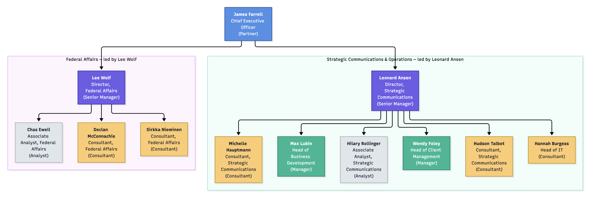

# Overview

**Shane Longman** is a fictional lobbying firm, with sample users generated from the character names of the cast of
the British TV series Capital City.

Shane Longman is organised into specialised practice areas, strategic support teams, and operational departments.

The core lobbying and practice group is Federal Affairs.
The support teams are Public Affairs and Strategic Communications, Intelligence and Analytics and Operations and Compliance
which includes the Business Development and Client Management teams.



## LDAP

An LDAP (Lightweight Directory Access Protocol) server stores and organises information about users and devices.
In an enterprise environment this might be Active Directory or Entra ID.

## LDIF

LDIF stands for LDAP Data Interchange Format. It is a plain-text file format used to represent LDAP directory content 
and commands.

It has three core elements:
- Organisational Units (OUs): Containers to hold users (`ou=users`) and groups (`ou=groups`).
- User Entries: Individual user records (e.g., `uid=lee.wolf`).
- Group Entries: Group records (e.g., `cn=analysts`) using the `groupOfNames` object class, listing member 
  Distinguished Names (DNs).

We can use the information obtained from a Directory Server (e.g., [OpenLDAP](https://www.openldap.org/)) to create 
users and groups in Keycloak (Serendipity's Indentity Service).

:::tip
Before you can make use of the information obtained from a Directory Server you must first configure Keycloak.
:::

### Base DN

The Base DN (Distinguished Name) is the top-level starting point in your LDAP directory tree where Keycloak (or any
LDAP client) begins searching for entries.

This information is not defined in the LDIF file but is required by the Directory Server on startup:

```shell
LDAP_ORGANISATION=Shane Longman
LDAP_DOMAIN=shane-longman.org
LDAP_BASE_DN=dc=shane-longman,dc=org
```

### User Entries

Each user has an entry in the LDIF file. For example:

```shell
dn: uid=chas.ewell,ou=people,dc=shane-longman,dc=org
objectClass: inetOrgPerson
objectClass: organizationalPerson
objectClass: person
objectClass: top
uid: chas.ewell
cn: Chas Ewell
givenName: Chas
sn: Ewell
mail: chas.ewell@shane-longman.org
userPassword: secret
telephoneNumber: +61-20-7946-1111
title: Associate Analyst, Federal Affairs
departmentNumber: Federal Affairs
employeeType: analyst
manager: uid=lee.wolf,ou=people,dc=shane-longman,dc=org
description: bbbbbbbb-cccc-dddd-eeee-ffffffffffff
l: Canberra
st: ACT
```

### Groups

Each group is defined in the LDIF file. For example:

```shell
dn: cn=analysts,ou=groups,dc=shane-longman,dc=org
objectClass: groupOfNames
cn: analysts
description: The Analysts Group.
member: uid=chas.ewell,ou=people,dc=shane-longman,dc=org
member: uid=hilary.rollinger,ou=people,dc=shane-longman,dc=org
```

Each user is assigned to one or more groups.

## References

* Wikipedia: [Capital City - TV Series](https://en.wikipedia.org/wiki/Capital_City_(TV_series))
* OpenLDAP website: [OpenLDAP](https://www.openldap.org/)
